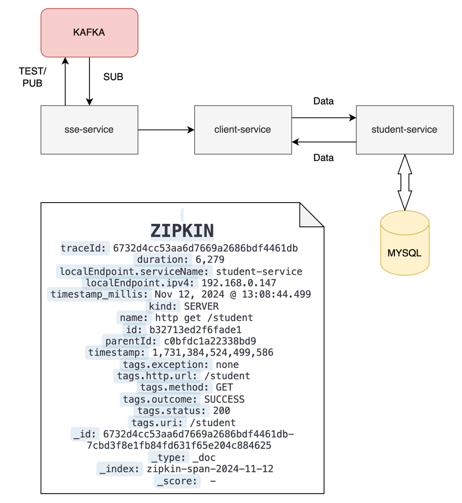
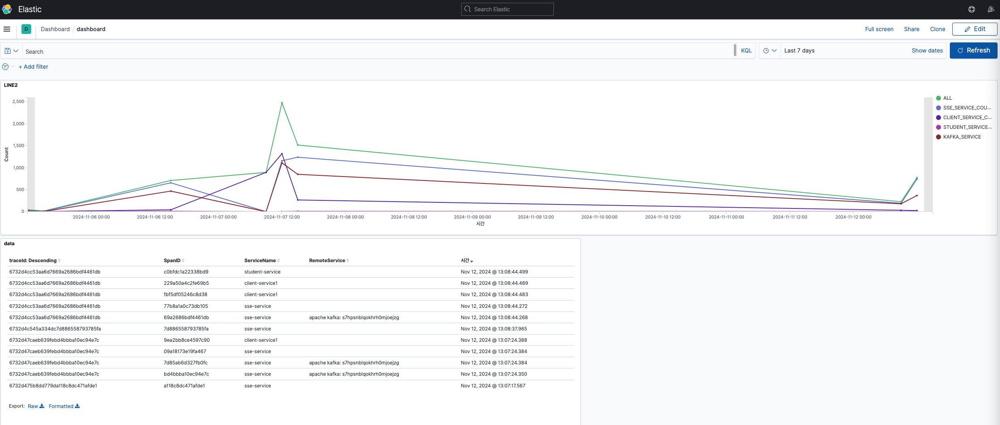
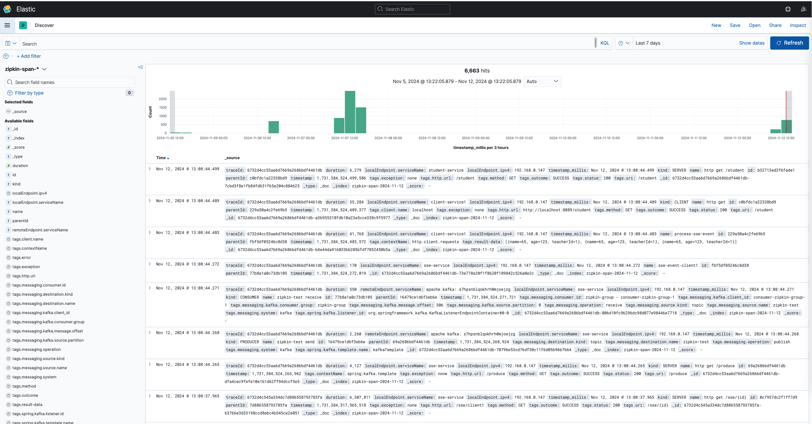

# spring-zipkin-kafka

## 🏠 소개

- sse-service는 Kafka에서 메시지를 소비할 때마다 이를 Server-Sent Events(SSE)를 통해 client-service로 전송합니다.
- client-service는 수신한 SSE 데이터를 바탕으로 Spring Feign Client를 사용해 student-service에 데이터를 요청합니다.
- student-service는 요청받은 데이터를 조회한 후, 결과를 반환합니다.
- 이러한 모든 과정은 Zipkin을 통해 하나의 TraceId로 묶어 추적 및 관리됩니다.

## 📺 개발 환경

- 
- 
- 
- 
- 

## 🗓 2024-11-12

- SpringBoot 3.0
    - Spring Cloud Sleuth를 Micrometer Tracing으로 이관

  
  

